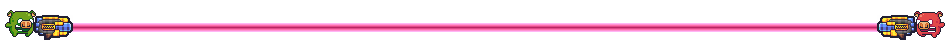
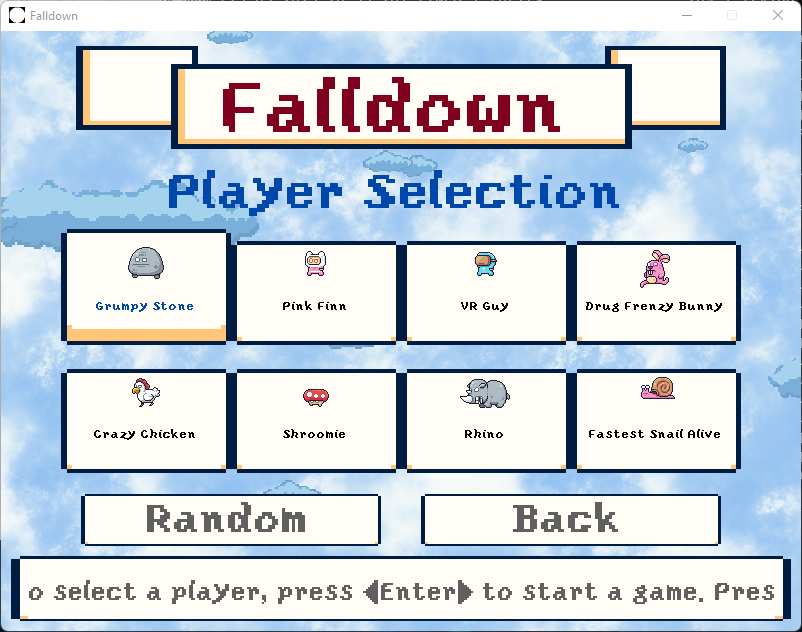
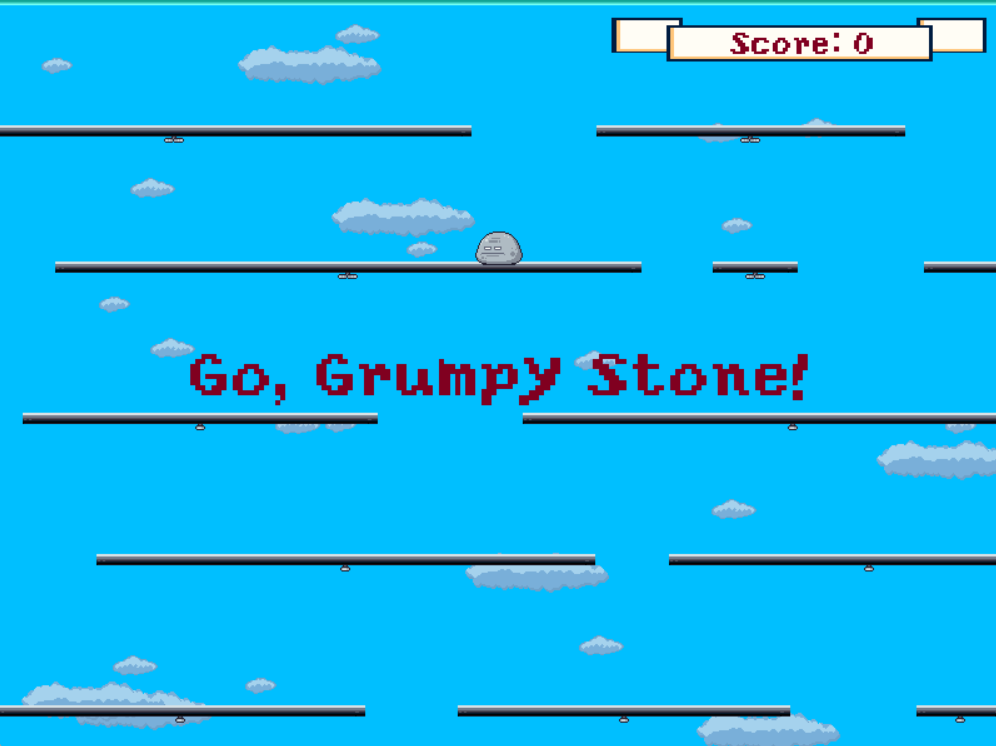
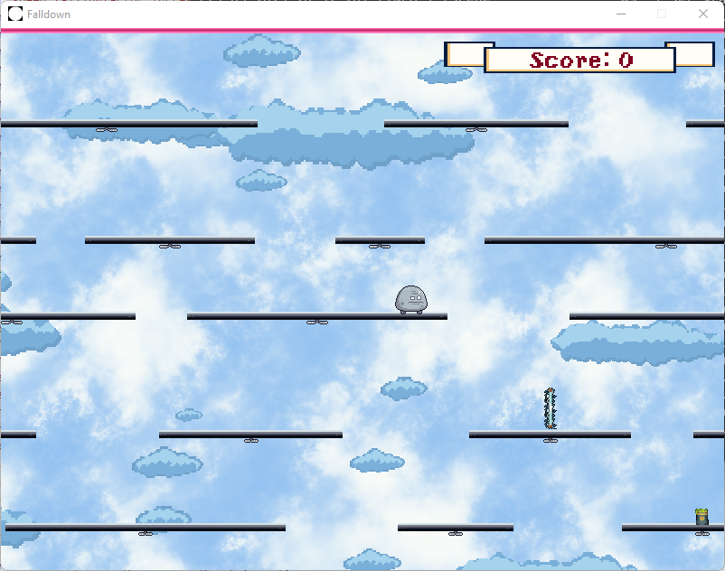
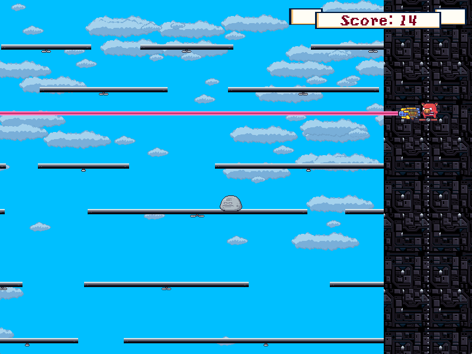
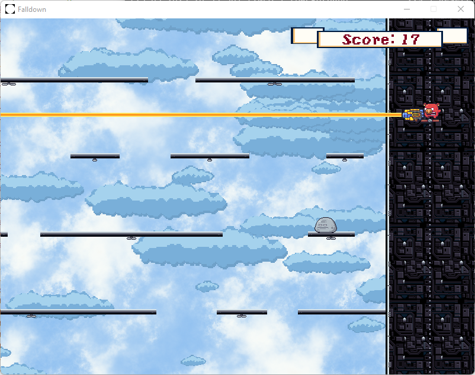
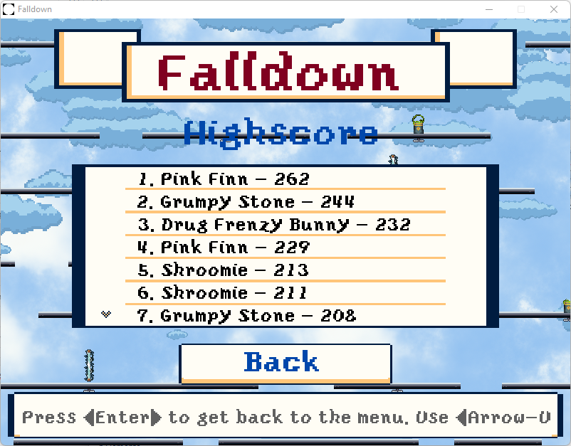

# Falldown

* A game where the player - one of eight sketchy guys - has to fall down as far as possible
* Two evil swines on the left and on the right side have a laser gun and will hunt the player down
* Some of the lines are moving from left to right
* Every sketchy guys have slightly different behaviour
* Two "Powers" to run over
    * Clear a single segment
    * Clear all segments
* Local highscore
* Options
    * Play in windowed or fullscreen mode
    * Different languages
        * English
        * German

## Key mappings

* In player selection:
    * Press "Tab" to show/hide additional player information
* When in-game:
    * Press "Escape" or "Space" to pause game
    * Press "f" to display fps

## Copyright

Copyright 2023 Denis Meyer

## Screenshots

Player Selection:  

New Game Started:  

"Clear segment" and "clear all lines" powers:  

Left Side, Green Swine:  

Right Side, Red Swine:  

The Highscore View:  

## Attributions

### Button images

* "GUI Essential Pack" by Crusenho (https://crusenho.itch.io/complete-gui-essential-pack)

### Sprites

* "Seemless Sky Backgrounds" by Screaming Brain Studios (https://screamingbrainstudios.itch.io/seamless-sky-backgrounds)
* "Pixel Clouds" by GarzettDev (https://garzettdev.itch.io/pixel-clouds)
* "Industrial Tileset" by Atomicrealm (https://atomicrealm.itch.io/industrial-tileset)
* "Pixel Adventure 1" by Pixelfrog (https://pixelfrog-assets.itch.io/pixel-adventure-1)
* "Pixel Adventure 2" by Pixelfrog (https://pixelfrog-assets.itch.io/pixel-adventure-2)
* "Massive Weapon Package" by GameSupplyGuy (https://gamesupply.itch.io/massive-weapon-package)
* "Bows and Guns" by SnoopethDuckDuck (https://snoopethduckduck.itch.io/bows-and-guns)
* "Trap Pack" by Foozlecc (https://foozlecc.itch.io/trap-pack)

### Font

* "Yoster Island" by codeman38 (https://www.fontspace.com/yoster-island-font-f5850)

### Music

* Various sound effects by MixKit (https://mixkit.co/free-sound-effects/click/)
* Background and in-game background music "Abstraction" by Benjamin Burnes (https://abstractionmusic.com)
