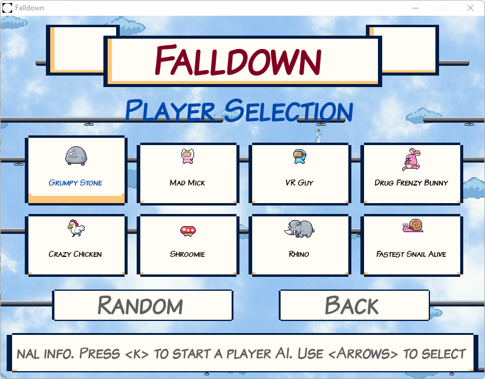
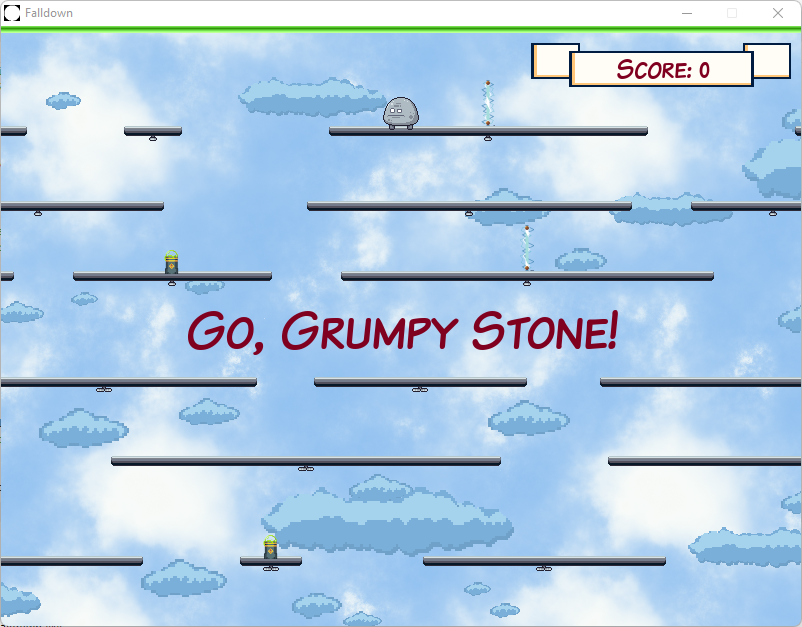
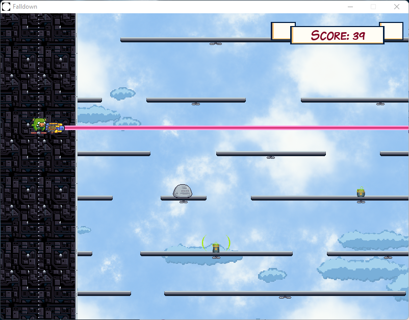
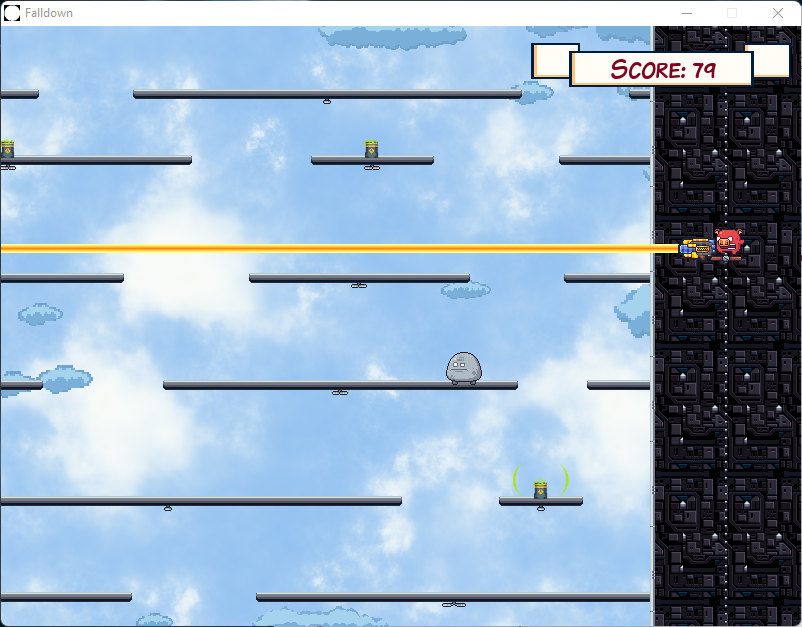
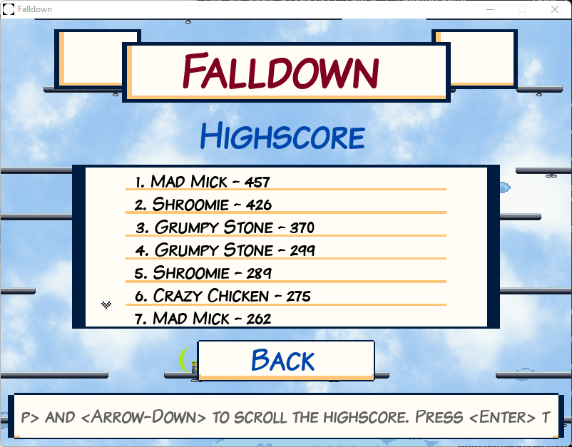

# Falldown

* A game where the player - one of eight sketchy guys - has to fall down as far as possible
* Two evil swines on the left and on the right side have a laser gun and will hunt the player down
* Some of the lines are changing directions periodically
* Every sketchy guys have slightly different behaviour
* There are two "Powers" the player can run over
    * Clear a single segment
    * Clear all segments
* Local highscore
* Player AIs to demonstrate the gameplay
* Options
    * Play in windowed or fullscreen mode
    * Two languages
        * English
        * German
* Keyboard and controller support

## Key mappings

* In main menu:
    * Press "k" to start a random player AI (alternatively the player AI starts after 12 seconds automatically)
* In options menu:
    * Press "-" on music/effects to decrease volume
    * Press "+" on music/effects to increase volume
* In player selection menu:
    * Press "k" to start the selected player AI
    * Press "Tab" or "-" to show/hide additional player information
* When in-game:
    * Press "Escape" or "Space" to pause game
    * Press "f" or "-" to display fps

## Controller mappings

The following controllers are supported:

* XBox 360
* Nintendo Pro

Mappings

* In main menu:
    * Press "X" to start a random player AI (alternatively the player AI starts after 12 seconds automatically)
* In options menu:
    * Press "L"/"LB" on music/effects to decrease volume
    * Press "R"/"RB" on music/effects to increase volume
* In player selection menu:
    * Press "X" to start the selected player AI
    * Press "L"/"LB" to show/hide additional player information
* When in-game:
    * Press "B" or "Start" to pause game
    * Press "L"/"LB" to display fps

## Copyright

Copyright 2023 Denis Meyer

## Screenshots

Player selection:  

New game started and "clear segment" and "clear all lines" powers:  

Left side, green swine:  

Right side, red swine:  

The highscore view:  

## Attributions

### Button images

* "GUI Essential Pack" by Crusenho (https://crusenho.itch.io/complete-gui-essential-pack)

### Sprites

* "Seemless Sky Backgrounds" by Screaming Brain Studios (https://screamingbrainstudios.itch.io/seamless-sky-backgrounds)
* "Pixel Clouds" by GarzettDev (https://garzettdev.itch.io/pixel-clouds)
* "Industrial Tileset" by Atomicrealm (https://atomicrealm.itch.io/industrial-tileset)
* "Pixel Adventure 1" by Pixelfrog (https://pixelfrog-assets.itch.io/pixel-adventure-1)
* "Pixel Adventure 2" by Pixelfrog (https://pixelfrog-assets.itch.io/pixel-adventure-2)
* "Massive Weapon Package" by GameSupplyGuy (https://gamesupply.itch.io/massive-weapon-package)
* "Bows and Guns" by SnoopethDuckDuck (https://snoopethduckduck.itch.io/bows-and-guns)
* "Trap Pack" by Foozlecc (https://foozlecc.itch.io/trap-pack)
* "Free Pixel Art Explosions" by CraftpixNet (https://free-game-assets.itch.io/11-free-pixel-art-explosion-sprites)

### Font

* "Komika" by Apostrophic Laboratories (https://www.1001fonts.com/komika-font.html)

### Music

* Various sound effects by MixKit (https://mixkit.co/free-sound-effects/click/)
* Background and in-game background music "Abstraction" by Benjamin Burnes (https://abstractionmusic.com)
